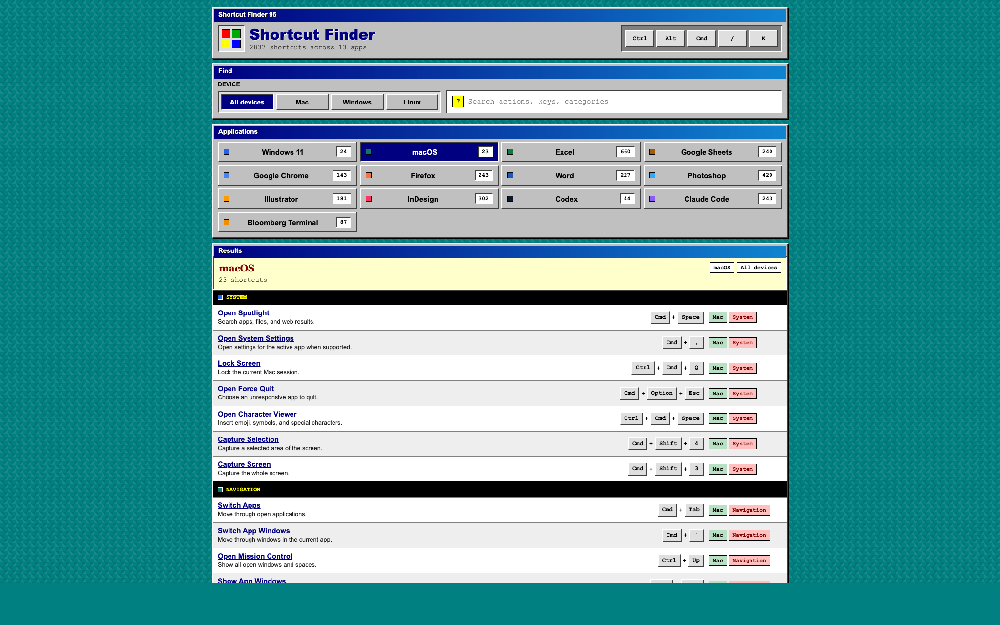

# Shortcut Finder

Shortcut Finder is a self-contained browser app for searching keyboard shortcuts across common apps and operating systems. It has a Windows 95-inspired interface with device filters, app filters, and full-text search over actions, keys, categories, and tags.

## Usage

Open the live app at <https://stochastropy.com/shortcuts/>.

Open `index.html` in a modern browser. There is no build step, package install, or local server required.

## Project Structure

- `index.html` contains the app, styles, shortcut data, and client-side behavior.
- `assets/screenshot.png` is the screenshot used in this README.

## License

MIT
